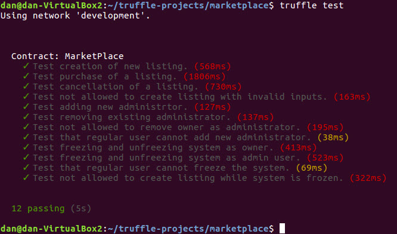
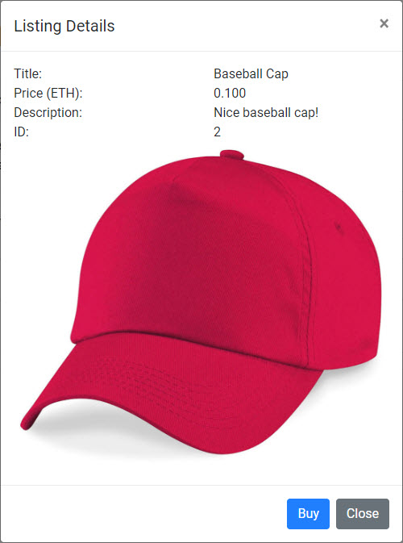

# Ethereum Marketplace dApp

This repository contains an Ethereum Marketplace dApp. It is similar to a very basic eBay.  Users can list items for sale and other users can buy them with Ether.  It was developed as the final project for ConsenSys Academy's 2018 Developer Program.  The smart contracts were developed in [Solidity](https://solidity.readthedocs.io/en/v0.4.24/) using the [Truffle](https://github.com/trufflesuite/truffle) framework.  The user interface was developed using [React](https://reactjs.org/) and [reactstrap](https://reactstrap.github.io/).

A React app folder was created using [Create React App](https://github.com/facebookincubator/create-react-app).  `truffle init` was used to create a separate Truffle project folder.  The two folders were merged by copying one over the other.  To allow the [web3](https://github.com/ethereum/wiki/wiki/JavaScript-API) API in the React app to access the contract ABIs, the Truffle `contracts` folder was symbolically linked to appear under the React `src` folder.

## Steps to Install and Run:
*(Assuming you've already installed Node.js, npm, ganache-cli, Truffle and MetaMask, and have cloned this repo.)*<p>
From the root project folder, run the following commands.
```
npm install
```
Link contract artifacts folder.  If using Windows Command Prompt:
```
mklink /J src\contracts build\contracts 
```
Or, if using Windows Powershell:
```
cmd /c mklink /J src\contracts build\contracts
```
Launch Ganache:
```
ganache-cli
```
*(I run this and all subsequent commands in a Windows PowerShell)*.

After launching Ganache, copy the mnemonic phrase from the Ganache console. Use it to import this account using seed phrase into MetaMask in your browser.  Before importing select network ```Localhost 8545``` in MetaMask.

In another shell, to compile, migrate and test the smart contracts:
```
truffle compile
truffle migrate
truffle test
```
All tests should pass:



Launch application in development mode on http://localhost:3000:
```
npm start
```
## What does this application do?
When the application is accessed it first checks that injected web3 is detected in the browser.  If not, it displays "<span style="color:red">MetaMask is Not Enabled!</span>".  If MetaMask is enabled, but user is not logged into a MetaMask wallet, it displays "<span style="color:red">MetaMask Account is Locked!</span>". 

It also checks if the current user account is an application administrator.  If the current MetaMask wallet was generated using the mnemonic phrase from Ganache, then MetaMask Account 1 will have administrator access and can assign other adminstrators from the displayed ```System``` dropdown menu.  Currently, there are only two special privileges that an administrator has:
1. Assign or revoke administrator access for other users.
2. Freeze or Unfreeze the system.

A list of all active listings is displayed under the "All Listings" tab.  If there are no active listings, the application displays "No active listings...".


To add a new listing, select ```My Listings``` and then ```Create Listing```. Provide listing ```Title```, ```Price``` and ```Description```.  Then click ```Create Listing```.


Confirm transaction in MetaMask.  In a few seconds when the block for the transaction has been mined, the new listing will appear under both ```All Listings``` and ```My Listings``` tabs:


The listing will show with status of "Selling" under the ```My Listings```.

*(If after confirming a transaction in MetaMask it fails with an "RPC Error...", in MetaMask go to "Settings" and click "Reset Account". MetaMask can get confused when running on a private network if you stop and restart Ganache.)*.

To view details of a listing, click on it's Title.  If you view the listing from the same account that created it, you will see a button to cancel the listing:


When the transaction is complete the transaction will display under ```My Listings``` only with Status of "Cancelled".


If you create and switch to "Account 2" in MetaMask and then reload the page, the page will update to reflect the new Account 2 address and balance. The ```System``` menu in the upper right will disappear since Account 2 is not an administrator. Now if you view details for a listing, you will see a button to "Buy" the listing:



If you click "Buy", MetaMask will display pending transaction for the price of the listing.  After transaction completion the listing will disapper from ```All Listings``` tab and your displayed balance will decrease by the price of the listing.  If you switch back to Account 1 and click ```My Listings```, the listing will display with Status of Sold:


An administrator can "Freeze" the system if needed to stop processing of all listing related transactions.  To freeze the system (while logged in as Account 1) select System > Freeze System.


When the transaction is confirmed and completed, the system will be frozen.  If you now attempt to buy a listing, an alert will display and the transaction will be blocked:


To unfreeze the system, select System > Unfreeze System. 


It is also possible to add and remove users as administrators.  If a user attempts to remove the contract owner (Account 1 in this case) they will be blocked with a transaction revert exception.  The owner of the contract must always remain an administrator.